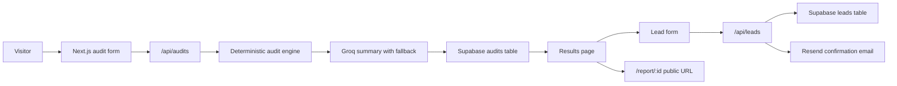

# Architecture



## Data Flow

A user enters team size, use case, and paid AI tools. The client persists that form in `localStorage`, then posts the payload to `/api/audits`. The server validates input, runs deterministic pricing rules, asks Groq for a short personalized summary, falls back to a template if needed, stores the public-safe report in Supabase, and returns the result plus share URL.

Email, company name, and role are captured only after the audit is shown. Those fields are stored in the `leads` table and never copied to the public report payload.

## Stack Choice

Next.js + TypeScript gives typed server routes, server-rendered report pages, and easy Vercel deployment. Tailwind and shadcn-style primitives keep the UI fast to build while preserving accessibility and visual control. Supabase provides a real backend with low setup cost, Resend handles transactional email, and Groq is used only for the personalized prose summary.

## Supabase Tables

The schema is also available in `supabase/schema.sql`.

```sql
create table audits (
  id uuid primary key,
  team_size int not null,
  use_case text not null,
  total_monthly_spend numeric not null,
  total_monthly_savings numeric not null,
  total_annual_savings numeric not null,
  result jsonb not null,
  created_at timestamptz default now()
);

create table leads (
  id uuid primary key default gen_random_uuid(),
  audit_id uuid references audits(id),
  email text not null,
  company_name text,
  role text,
  team_size int,
  created_at timestamptz default now()
);
```

## Abuse Protection

The lead form includes a hidden honeypot field and server-side rate limiting by email. Audit creation is also rate-limited by forwarded IP. This is enough for a take-home MVP while keeping the funnel low-friction.

## Scaling To 10k Audits Per Day

Move rate limiting to Redis or Upstash, add a durable email queue, make Groq summary generation asynchronous, and store normalized line items separately from the JSON report for analytics. Cache public report pages at the edge because they are read-heavy and immutable after creation.
